# ONLYOFFICE SmartArt editing: live demos

Real Chromium captures from DocumentServer, using synthetic files. The comparison is **stock ONLYOFFICE 9.4.0** versus **9.4.0 with the SDK/UI PR builds**. It is not a build of the exact parent commits; unrelated upstream toolbar differences may also appear.

- [SDK PR #4893](https://github.com/ONLYOFFICE/sdkjs/pull/4893): `fef3dd407bd1bbac1d74c77160f42aedfeb85353`
- [UI PR #3227](https://github.com/ONLYOFFICE/web-apps/pull/3227): `d588463c251fc17e5c31d5c0bc18d712e271331d`
- Captured 2026-10-03 at 1440 × 960. [Build and verification metadata](verification.json).

The Office files start with **Plan → Build → Review**. In the PR build, click **Edit SmartArt**, select Review, add **Release**, and Apply. The diagram becomes four nodes. Each video shows the baseline first, then the PR build. PDF uses a plain PDF in the actual PDF editor, enters its normal Edit PDF mode, inserts a Basic Process diagram, and adds Release to its three initial placeholders.

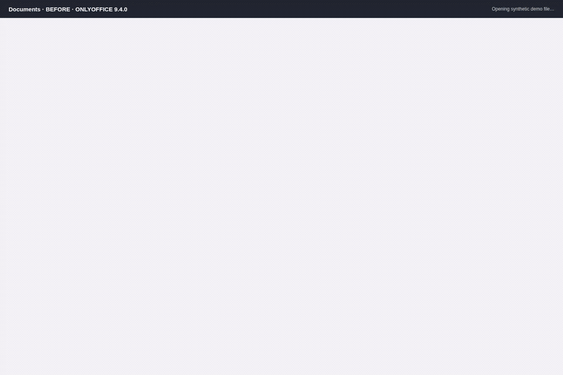

## Screenshots and videos

Click an image for full resolution. MP4 links open the recordings; download/raw is available from the file page if needed. Videos concatenate the two browser recordings without changing the demonstrated behavior.

| Editor | Stock 9.4.0 | PR: editing dialog | PR: applied result | Video |
| --- | --- | --- | --- | --- |
| Documents | 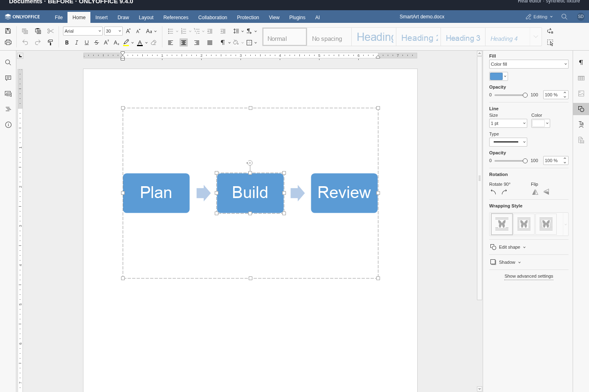 | 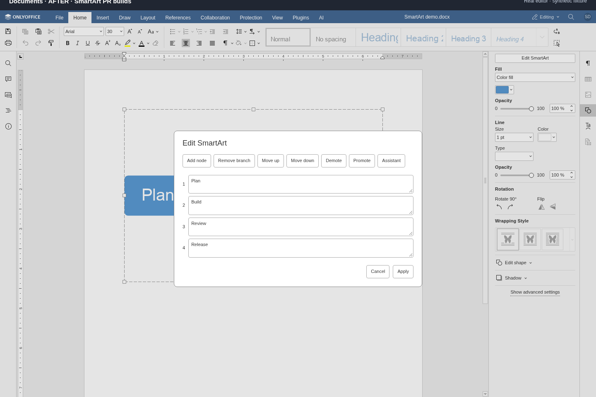 | 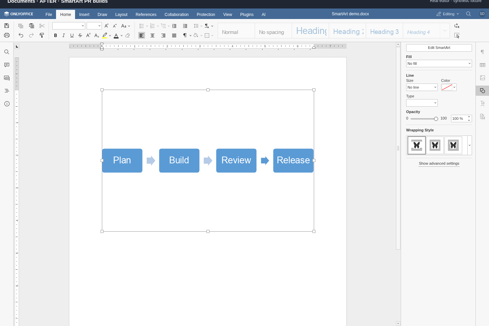 | [MP4](media/word-before-after.mp4) |
| Spreadsheets | 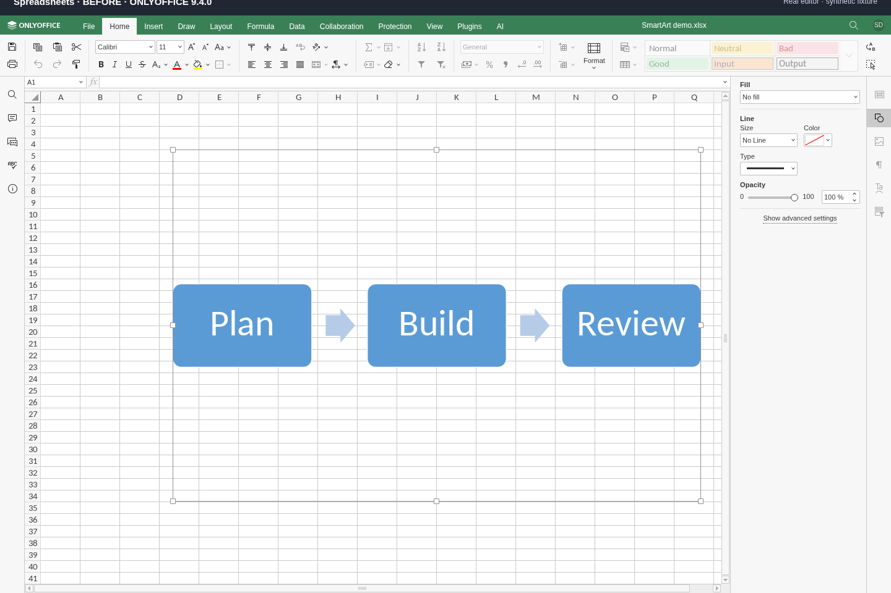 | 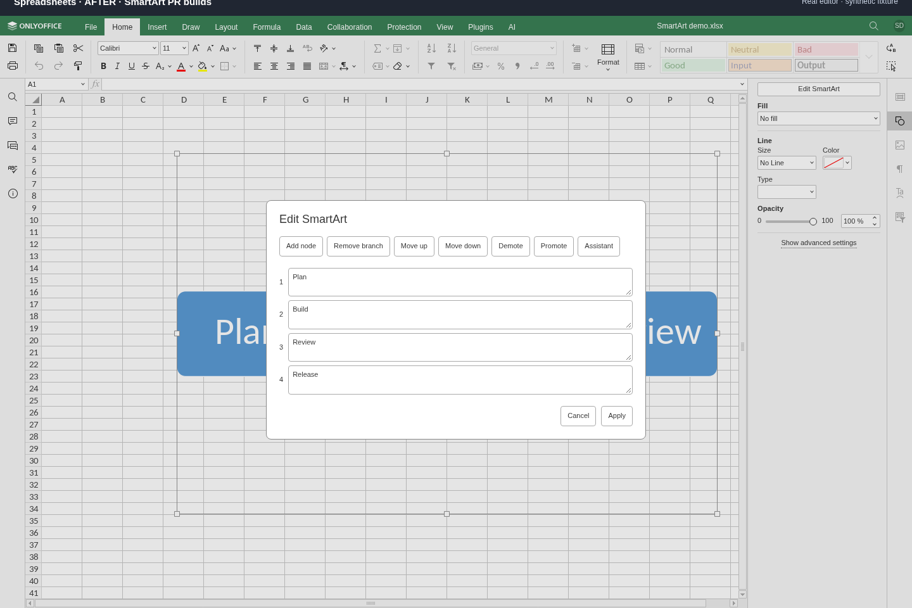 | 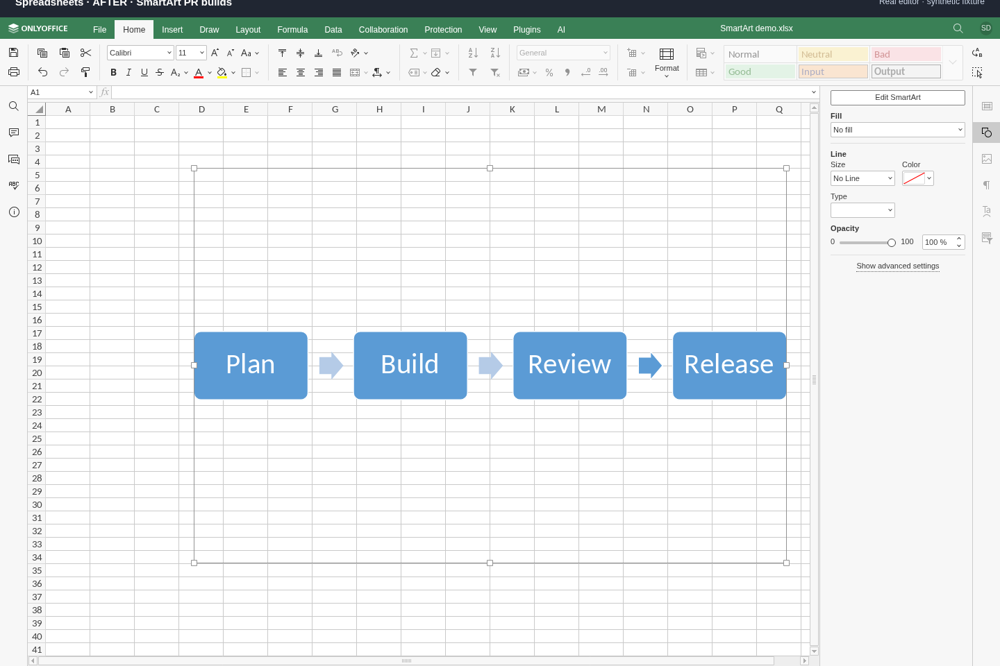 | [MP4](media/cell-before-after.mp4) |
| Presentations | 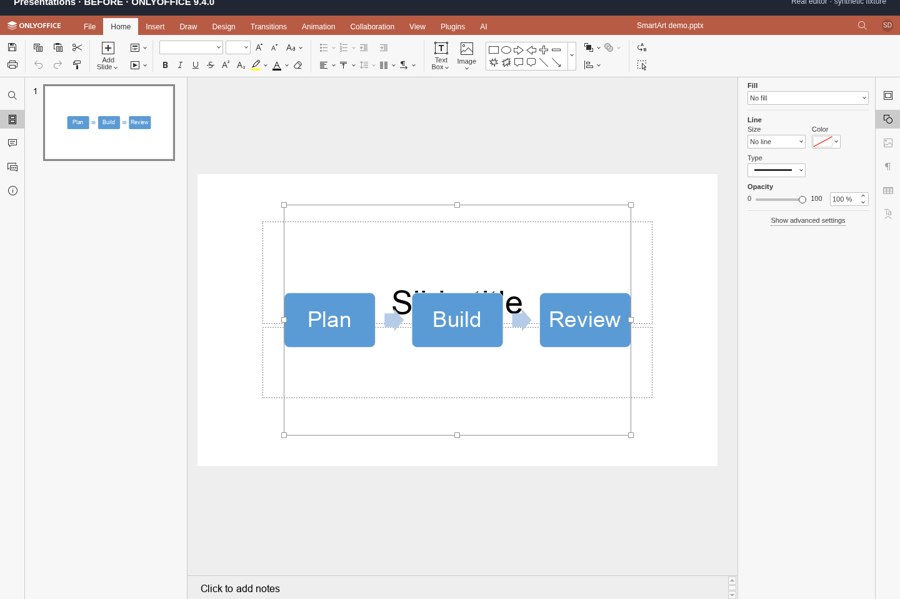 | 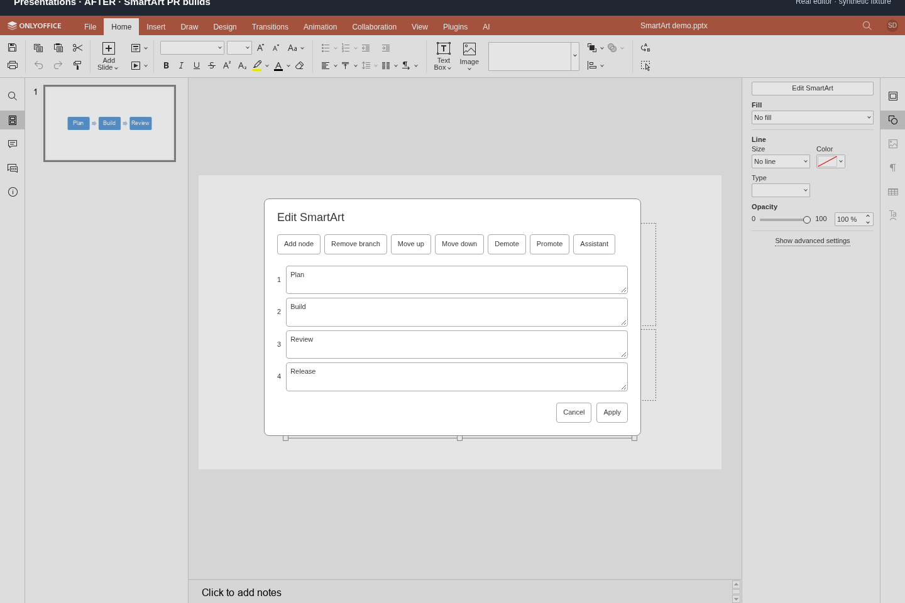 |  | [MP4](media/slide-before-after.mp4) |
| PDF | 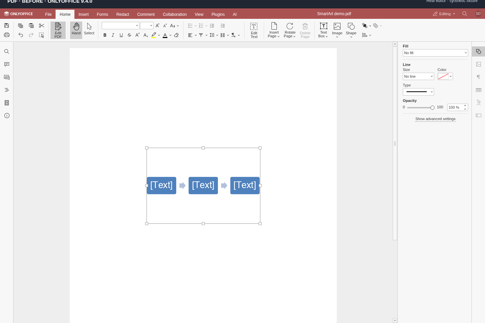 | 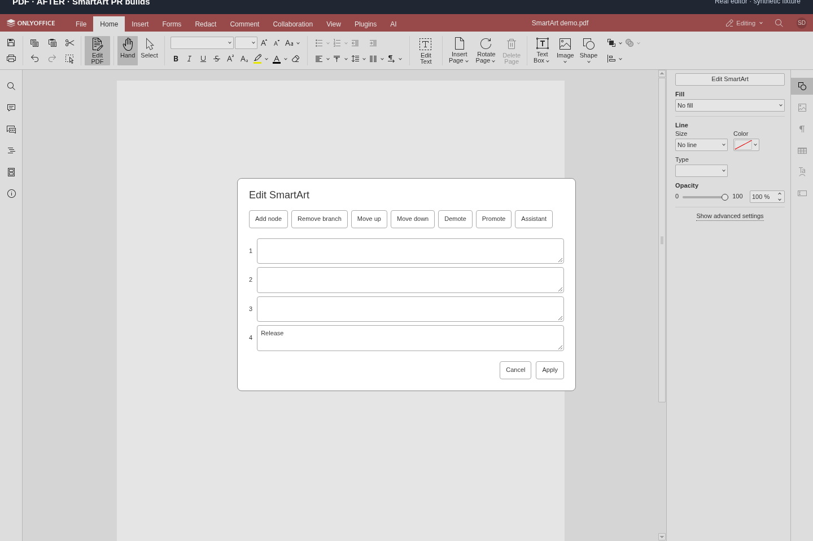 | 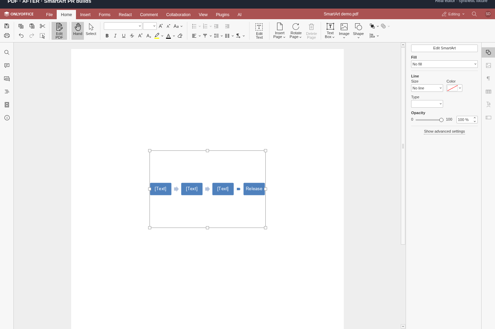 | [MP4](media/pdf-before-after.mp4) |

The new sidebar entry before opening the dialog: [Documents](media/word-after.png), [Spreadsheets](media/cell-after.png), [Presentations](media/slide-after.png), [PDF](media/pdf-after.png).

## Save and reopen

These screenshots come from downloading the edited file, opening it in a fresh DocumentServer session, and checking both its SmartArt outline and rendered text. All three Office formats retain **Plan, Build, Review, Release**. This check caught and fixed placeholder text corruption in SDK commit `fef3dd4`.

| Format | Reopened screenshot | Original three-node file | Saved four-node file |
| --- | --- | --- | --- |
| DOCX | 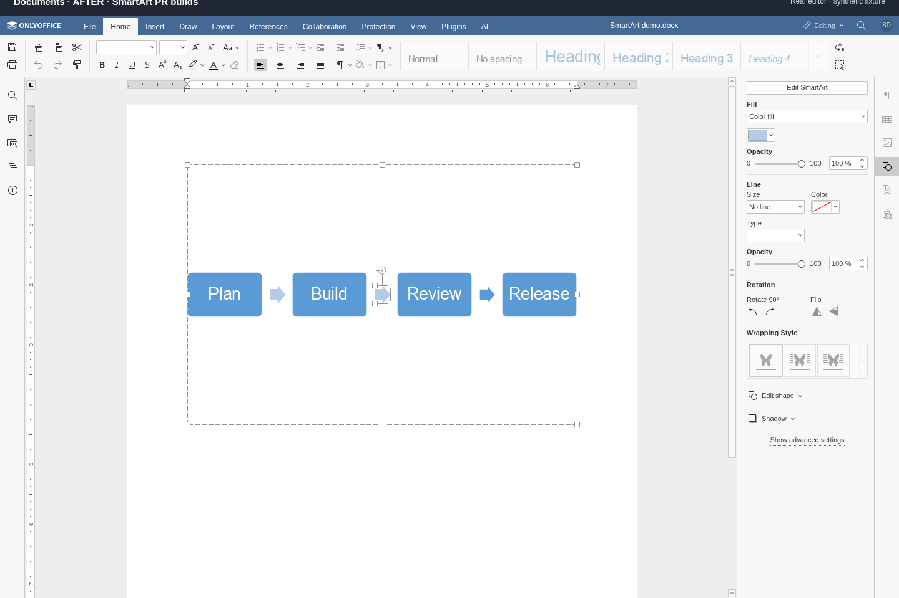 | [seed.docx](fixtures/seed.docx) | [result.docx](fixtures/result.docx) |
| XLSX |  | [seed.xlsx](fixtures/seed.xlsx) | [result.xlsx](fixtures/result.xlsx) |
| PPTX | 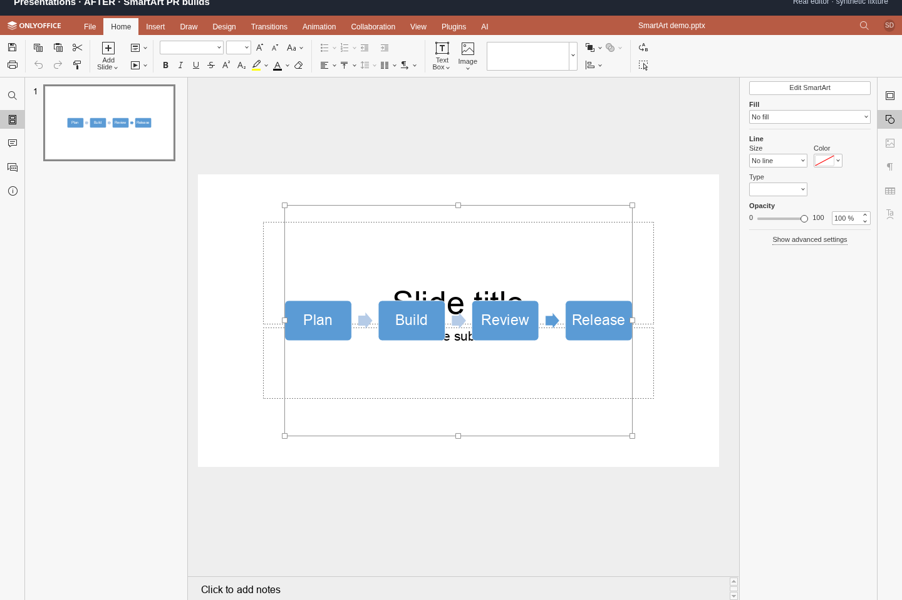 | [seed.pptx](fixtures/seed.pptx) | [result.pptx](fixtures/result.pptx) |

## What was built and checked

Four main UI builds, including their CSS, icons, common launcher, and shared dialog; three production mobile browser UI builds. Focused Chromium SDK tests passed **152/152 in each of 11 product/build combinations**: Word/Cell/Slide/PDF for web and desktop SDK configurations, Word/Cell/Slide for mobile SDK configurations. Every tested configuration includes the 151-preset structural editing checks.

The recordings exercise all four live main editors. They open the real sidebar/dialog and use the real Add node/Apply controls. The automation uses SDK calls to insert/select the synthetic diagram, prepare its initial labels, and download results; see [capture.cjs](scripts/capture.cjs).

**Limits:** PDF editing is demonstrated during an active session; a saved PDF SmartArt roundtrip is not verified. Mobile browser bundles built successfully, but there is no live mobile recording here. The native Desktop Editors shell and standalone iOS/Android apps were not built. Live multi-client collaboration is not verified. Native iOS/Android UI/bridge integration remains outside these PRs because the relevant repositories are inaccessible to this account.

## Reproduce locally

Use Linux with Docker, Python, Node/npm, Chromium, ffmpeg, and tmux. Place this checkout beside `sdkjs` and `web-apps`, checked out at the commits above, and install the existing build dependencies in `web-apps/build` and `web-apps/vendor/framework7-react`. The helper serves only synthetic demo files; the two DocumentServers listen on loopback ports 8780/8781. Port 8782 must be reachable by their Docker containers. JWT is disabled for this local demo.

```sh
# From this evidence checkout. Build the SDK and four main UIs.
python scripts/build.py

# Stage assets and start both DocumentServers plus the DocsAPI host.
bash scripts/start.sh

# Wait until both respond with true; startup can take a few minutes.
curl http://127.0.0.1:8780/healthcheck
curl http://127.0.0.1:8781/healthcheck

# Keep capture dependencies outside tracked source.
npm install --prefix runtime/playwright --no-package-lock playwright
export PLAYWRIGHT_PATH="$PWD/runtime/playwright/node_modules/playwright"
node "$PLAYWRIGHT_PATH/cli.js" install ffmpeg
node scripts/capture.cjs record word cell slide pdf
node scripts/capture.cjs reopen word cell slide
python scripts/export.py
```

The committed fixtures are sufficient for recording. To regenerate the three Office seeds: `node scripts/capture.cjs seed word cell slide`. To refresh previously staged assets after rebuilding, run `bash scripts/stage.sh` before recording. It preserves packaged font/WASM resources and removes stale gzip sidecars so nginx serves the rebuilt scripts.

For the three additional mobile builds, run `npm run deploy-word`, `npm run deploy-cell`, and `npm run deploy-slide` in `web-apps/vendor/framework7-react`; these output into their editor's `apps/*/mobile` directory. The main capture host uses the main UIs, not these mobile bundles.

For focused SDK checks, run in `sdkjs`:

```sh
python tests/run-smartart.py word cell slide pdf
python tests/run-smartart.py --desktop word cell slide pdf
python tests/run-smartart.py --mobile word cell slide
```

Build tests regenerate SDK assets; rebuild/restage normal SDK assets before returning to the live demo. Open `http://127.0.0.1:8782/demo?product=word&build=after&fixture=seed`, substituting `cell`, `slide`, or `pdf` (PDF uses `fixture=blank`). Use `build=before` for the baseline or `fixture=result` to inspect a saved Office result.

Long jobs can run in tmux; the host session is `onlyoffice-demo-host`. To stop the demo: `docker stop onlyoffice-smartart-before onlyoffice-smartart-after`, then `tmux kill-session -t onlyoffice-demo-host`. This evidence branch keeps screenshots, videos, fixtures, and reproduction helpers separate from the feature PR diff; runtime assets and logs are ignored.
